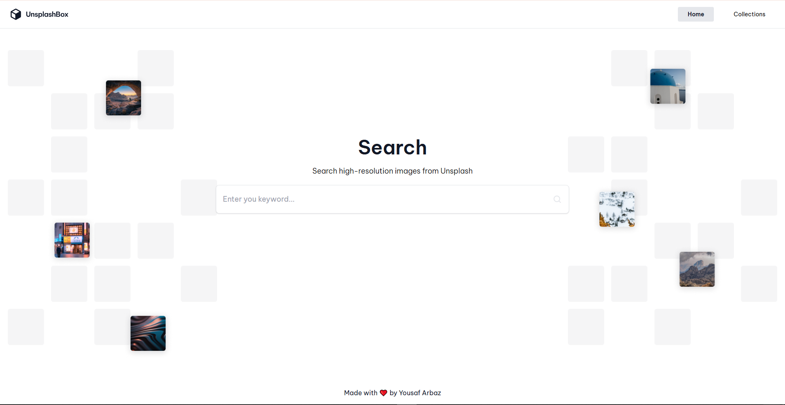

# UnsplashBox

UnsplashBox is a simple and elegant application that allows users to search and download high-quality images from Unsplash. The application provides an intuitive interface for browsing and saving images for personal or professional use.

  
  

## Features

- Search for images by keywords
- Browse your collections
- Download images in various resolutions
- Login with your unsplash account
- Add and Remove images to collections
- User-friendly and responsive design
## Technologies Used  

- **React.js**  
- **Axios**  
- **Tailwind CSS**  
- **RESTful APIs**  
- **Zustand**  
- **Fuse.js**  
- **Vite for build**  

## Live Demo  

You can view the live application [here](https://unsplashbox-app.netlify.app/).  

## Installation

1. Clone the repository:
    ```bash
    git clone https://github.com/arbaz93/unsplashbox.git
    ```
2. Navigate to the project directory:
    ```bash
    cd UnsplashBox
    ```
3. Install the required dependencies:
    ```bash
    npm install
    ```
## Get API key

1. Go to [https://unsplash.com/developers](https://unsplash.com/developers) and register as a developer
2. Navigate to "Your apps" and create a new app
3. Your Access key will be your client_id
4. You will have to grant Public, Read collections and write collections Access (If you are playing around you can check all the boxes in Redirect URI & Permissions section)
5. Copy/Paste your Access and Secret key to .env file.

## Usage

1. Start the application:
    ```bash
    npm run dev
    ```
2. Open your browser and go to `http://localhost:5173`

## Contributing

We welcome contributions to UnsplashBox! To contribute, please follow these steps:

1. Fork the repository
2. Create a new branch (`git checkout -b feature-branch`)
3. Make your changes and commit them (`git commit -m 'Add new feature'`)
4. Push to the branch (`git push origin feature-branch`)
5. Create a new Pull Request

## License

This project is licensed under the MIT License. See the [LICENSE](./LICENSE) file for details.

## Acknowledgements

- [Unsplash](https://unsplash.com) for providing the API and high-quality images
- [Inspiration and design from Devchallenges](https://devchallenges.io)
